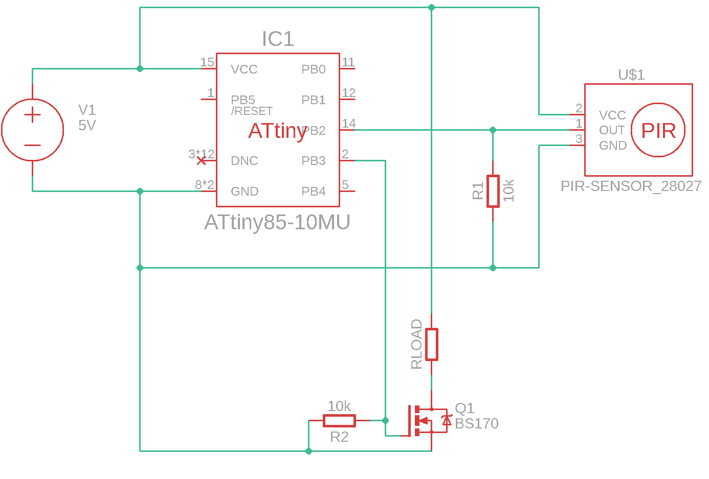

# ATTiny85 Power Trigger

Simple power trigger board intended for low-current USB powered devices. Used to turn the pump on my cat's water bowl on only when there's presence near the water bowl. You can use any kind of sensor which has a simple toggling HIGH/LOW (default LOW) output such as a PIR or RCWL-0516 microwave sensor.

Probably has the pump turned off 90%+ of the time. Probably doesn't save much money. Was fun to make. This repo is just documentation of the project.

## Summary
- Current flows for 60 seconds minimum whenever the trigger's OUT signal is send to PB2.
- PB3 is activated and applies a voltage to the BS170 MOSFET.
- Every time PB2 is signalled, the timer is reset.
- BS170 chosen because it can deliver 500mA and the gate threshold is very low (they are also very cheap at approx 9p).
- Requires: https://www.sparkfun.com/tiny-avr-programmer.html for flashing the chip.

## Developing
- Requires platform.io
- Requires AVR programmer. I used: https://www.sparkfun.com/tiny-avr-programmer.html via ESD protected hub.
- A USB power source capable of delivering up to 500mA.

To flash an ATTiny85, plug it into the AVR programmer and plug the AVR programmer into the computer and run `pio run -t flash`.
